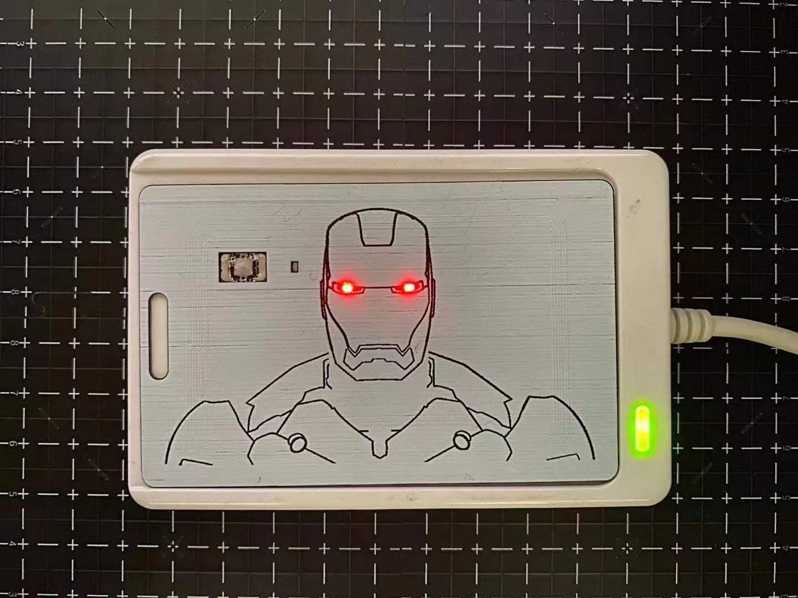

# 复刻了稚辉君大佬的项目，并进行了一些改进。
* 感谢两位的无私奉献
* 
* [simonire](https://github.com/simonire)
* [稚辉君](https://github.com/peng-zhihui)

## 主要改进

### 结构外观方面

> 外壳顶部中间位置增加了挂耳，方便作为钥匙扣
> 
> 修改了按钮的结构，使得固定更加稳固
> 
> 采用激光雕刻透明亚克力板作为上盖板

### 附上稚辉君提到抖动算法的python脚本，可用于pcb文件中logo的制作。以及通过此种方法设计的IC卡。

> imagedithering.py

> 
> 
> 

### 另外记录过程中踩过的几个坑

> 微雪1.54寸墨水屏200x200分辨率，fpc座应采用24p-0.5mm下接。

> 边框四个固定螺丝为M2，长度6mm可用，更长没试过。

> 电源芯片TPS61221封装问题，simonire的pcb中封装更大，稚辉君pcb中是正确的。
> 
> 

# 以下为原文
---
# [L-ink]电子墨水屏NFC智能卡片
> 这是为了解决个人使用IC卡时遇到的一些痛点设计的一个迷你NFC智能卡片，基于STM32L051和ST25DV。
>
> 想着既然要自制这玩意那就往炫酷了做，于是很自觉地把电子墨水屏也加上了，顺手也写了个配套APP用于显示内容定制。
>
> 总之是个比较有意思的小项目，方案不算复杂，第一版设计也存在一些值得改进的地方，后续有空会继续优化方案设计的。

## 演示视频

B站指路：https://www.bilibili.com/video/BV1Cf4y1y7KT/

## 项目文件说明

* **Hardware**：source里面是电路原理图和PCB文件，使用Altium Designer打开；release里面是gerber文件可以直接发给厂家打样，也包含了元器件BOM表（部分IC不太常用可能要单独购买）。
* **Firmware**：STM32L051的固件，我提供了Clion和Keil两个版本的工程文件，源码内容是一致的，分两个版本只是因为个人对Clion爱得深沉。
* **3D Model**：屏幕架和外壳的3D文件，step格式一般3D建模软件都能打开编辑，STL格式用于直接3D打印。
* **DAP-Link**：自己设计的下载调试器的硬件和固件源码，也包括预编译的hex固件，如果你有J-Link或者ST-Link之类的下载器就不用这个了。
* **Android**：配套的APP安装包。

## 固件编译说明

STM32因为使用了L0系列的MCU，所以如果你是第一次在你的电脑上开发STM32L0，那么需要先装一下L0的固件支持包，有两种方式：

1. 使用STM32CubMX安装：

   

   

2. 使用Keil的Package Installer安装：

   

   

然后就不会报头文件的错误了。

有几点注意的：

* 如果想在Clion中编译工程的话可以参考我这篇教程：https://zhuanlan.zhihu.com/p/145801160
* Clion中OpenOCD默认是使用ST-Link下载，其他下载器自己修改工程目录下的stlink.cfg文件

## 关于硬件方案

硬件方案比较简单，主要IC就两个--STM32和ST25DV，电子墨水屏是200x200的单色屏幕，我是买的微雪的（注意如果是买的几年前的库存，那驱动芯片会有点区别导致代码不通用，只要是新款的应该都没问题）。

ST25DV作为NFC的PHY通过I2C总线和STM32通信，主要作用有两个：能量采集以及NFC通信。注意，ST25DV只是负责和手机进行NFC通信，而不负责IC卡的读写功能，因为**ST25DV只支持ISO 15693的RFID协议，而我们常用的IC卡（M1卡）是ISO 14443协议的**，所以并不能直接使用这颗芯片进行IC卡模拟。

IC卡的模拟功能这一版中实现得比较简单，就是直接集成了多颗UID芯片（很便宜，1~2元一片），然后和ST25DV共用NFC天线，卡片的切换是通过拨轮换挡实现的。好处在于，你可以把L-ink当作多张独立卡片的合集处理，复制和刷卡都是很直接的（使用PM3或者PN532等模块读取原卡信息并写入L-link）。当然缺点就是添加的卡片一多，按键的数量就要增加（因为每一档对应一张卡）。

所以我也在改进方案，后面可能会使用支持ISO 14443协议的ST95或者ST25T系列的芯片来实现软件层面的IC卡模拟功能。

另外下一个版本的硬件方案**我会把黑白的电子墨水屏换成彩色的**。

## 关于配套APP

Android APP目前只是实现了功能，这是基于我以前做的一个算法验证框架APP改的，UI还没有重新做设计，可以等后续更新。

工程文件的话我后面可以把其中的核心功能模块封装成Module，然后给个Sample Project供参考使用，工作太忙等我缓过这阵子先~

## 教程整理中...

有问题先看Issue（包括已经close的），另外

#### 跟项目工程无关的问题不要发在Issues里面！跟项目工程无关的问题不要发在Issues里面！跟项目工程无关的问题不要发在Issues里面！

聊天内容可以给我发评论或者私信（B站、知乎），我看到的话基本都会回复，issue里面发的话所有watch项目的人都会收到邮件，会对大家产生困扰的！

---

**以下是[simonire](https://github.com/simonire)修改的版本，适配新款的屏幕驱动，修改拨轮为五维按键，有需要的可以参考：**

https://github.com/simonire/L-ink_Card

